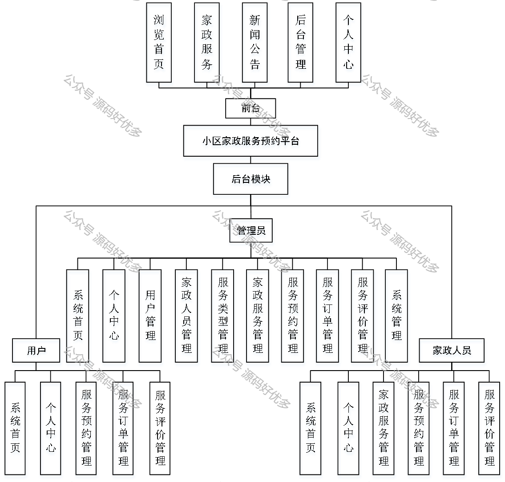
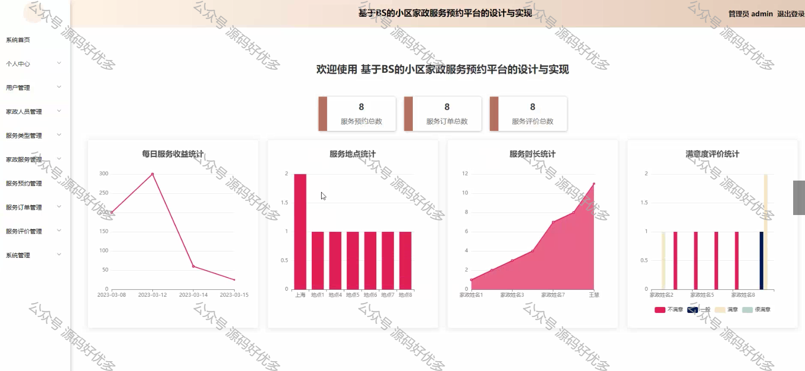
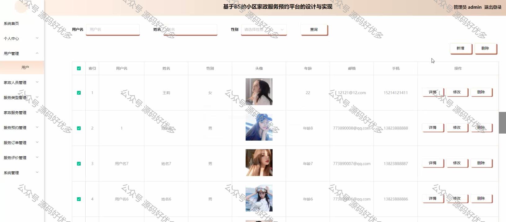
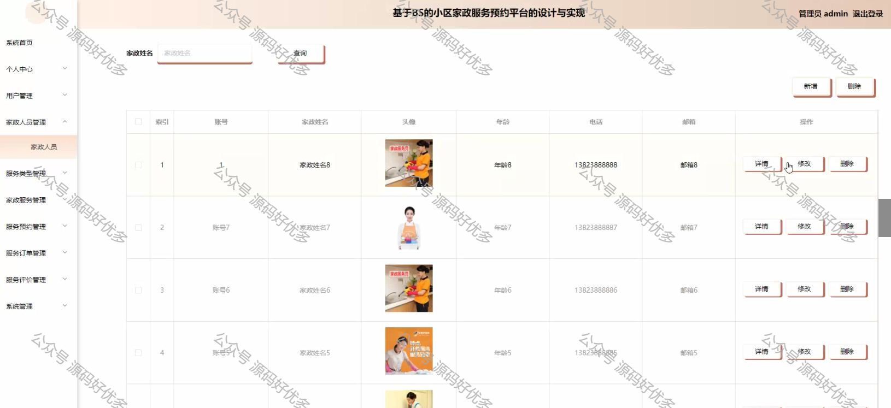

 
## 查看主页获取源码

> **作者介绍**： **✌**全网粉丝10W+本平台特邀作者、博客专家、CSDN新星计划导师、java领域优质创作者,博客之星、掘金/华为云/阿里云/InfoQ等平台优质作者、专注于毕业项目实战 **✌**

  

### 一、作品包含

源码+数据库+设计文档万字LW+PPT+全套环境和工具资源+部署教程

### 二、项目技术

前端技术：Html、Css、Js、Vue、Element-ui

数据库：MySQL

后端技术：Java、Spring Boot、MyBatis

  

### 三、运行环境

开发工具：IDEA/eclipse

数据库：MySQL8.0

数据库管理工具：Navicat10以上版本

环境配置软件： JDK1.8+Maven3.6.3

前端Nodejs：14

  

### 四、项目介绍

项目编号：springbootA056

近年来，科技飞速发展，在经济全球化的背景之下，互联网技术将进一步提高社会综合发展的效率和速度，互联网技术也会涉及到各个领域，而小区家政服务预约平台在网络背景下有着无法忽视的作用。信息管理系统的开发是一个不断优化的过程，随着网络数据时代的到来，信息管理系统与计算机的集成成为必然。
本次将以小区家政服务预约方面为切入点，论述了小区家政服务预约的意义和内容，以此展开对小区家政服务预约的开发与建设的详细分析。从数据挖掘的角度出发，了解信息管理系统的作用，对小区家政服务预约的过程以及用处进行更深一步的研究，数据的处理效率，以及具体的应用方向。对于小区家政服务预约平台所带来的影响，将从传统管理方式进行对比分析，从硬件优化、软件开发，这几个方面来论述小区家政服务预约平台的优势所在，分析小区家政服务预约在计算机时代发展的变化趋势。

### 五、运行截图

  
